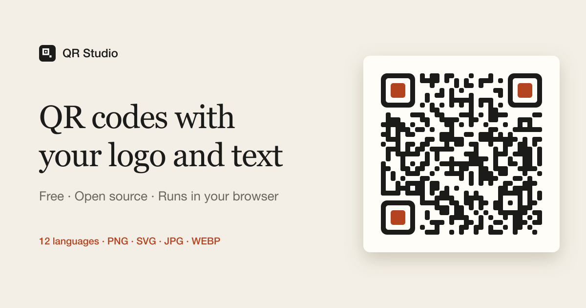

# QR Studio

**[Apri QR Studio →](https://mrcoloo.github.io/QR-Studio/)**



Generatore di QR code personalizzati: un link, un testo che spiega cosa c’è dietro, un logo e uno stile completamente modificabile. Funziona tutto nel browser, senza account e senza inviare dati a nessun server.

*A browser-only QR code designer: encode a link, add a caption and a logo, restyle every detail, and export print-ready files. Available in 12 languages.*

## Cosa fa

- **Contenuto**: link con controllo del formato, etichetta, titolo, descrizione, pulsante e link in chiaro; logo al centro scegliendo tra 24 icone, una sigla o un’immagine propria (anche trascinandola sulla tela).
- **Codice**: 12 forme per i moduli, 6 cornici e 7 pupille per gli occhi, colore pieno o sfumato, correzione errori L/M/Q/H.
- **Impaginazione**: 6 formati (quadrato, post 4:5, story 9:16, poster, banner 16:9, biglietto da visita), 5 disposizioni, sfondi pieni, sfumati, mesh o trasparenti, texture, piastra solida o in vetro, 11 famiglie di caratteri.
- **Leggibilità verificata**: a ogni modifica l’anteprima viene decodificata davvero con [ZXing](https://github.com/zxing-cpp/zxing-cpp) e viene misurato il contrasto, con suggerimenti se qualcosa non va.
- **Esportazione**: PNG, JPG, WEBP fino a 4×, SVG vettoriale con i font incorporati; copia negli appunti; link che riapre il design.
- **Due versioni**: *Semplice* mostra solo l’essenziale, *Completa* tutte le opzioni. La scelta viene ricordata.
- **12 lingue**: inglese, spagnolo, cinese, hindi, arabo (da destra a sinistra), portoghese, francese, russo, tedesco, giapponese, coreano e italiano. La lingua del browser viene riconosciuta alla prima visita; l’inglese fa da riserva.
- **Lavoro**: 12 preset, stile casuale, design salvati nel browser, annulla/ripeti, scorciatoie da tastiera, tema chiaro e scuro, layout per smartphone.

## Sviluppo

Serve Node.js 20.19 o successivo.

```bash
npm install
npm run dev
```

Build di produzione nella cartella `dist/`, pubblicabile su qualsiasi hosting statico:

```bash
npm run build
```

Il repository include un workflow ([`.github/workflows/deploy.yml`](.github/workflows/deploy.yml)) che pubblica automaticamente su GitHub Pages a ogni push su `main`. Nelle impostazioni del repository, in *Settings → Pages*, la sorgente deve essere **GitHub Actions**.

## Lingue e SEO

Ogni lingua ha la sua pagina statica (`/`, `/it/`, `/es/`…), generata in fase di build da [`vite.config.js`](vite.config.js) con titolo, descrizione, `hreflang`, Open Graph, dati strutturati (`WebApplication` e `FAQPage`) e una sezione descrittiva già tradotti; la build produce anche `sitemap.xml`. Dopo il primo deploy conviene aggiungere il sito a [Google Search Console](https://search.google.com/search-console) e inviare la sitemap.

Per aggiungere una lingua: crea `src/i18n/locales/<codice>.js` partendo da `en.js`, aggiungila a `LOCALES` in [`src/i18n/config.js`](src/i18n/config.js), all’elenco nello script in testa a `index.html` e agli import di `vite.config.js`.

Icone e immagine di anteprima in `public/` si rigenerano con `npm run assets`.

## Struttura

| File | Ruolo |
| --- | --- |
| `src/qr.js` | Matrice del QR e tracciati SVG di moduli e occhi |
| `src/render.js` | Composizione della card in un unico SVG (anteprima, export e verifica usano lo stesso) |
| `src/export.js` | Rasterizzazione, font incorporati, verifica con ZXing |
| `src/controls.js` | Schema dei controlli dei pannelli e loro collegamento allo stato |
| `src/state.js` | Stato con annulla/ripeti, salvataggio locale e link condivisibili |
| `src/data.js` | Formati, font, preset e stato iniziale |
| `src/i18n/` | Lingue supportate, dizionari e traduzione del markup statico |
| `src/glyphs.js` | Icone Phosphor usate dall’app, generate con `npm run glyphs` |

## Contribuire

Segnalazioni e pull request sono benvenute. Per modifiche grandi apri prima una issue per parlarne. Prima di proporre una modifica controlla che `npm run build` vada a buon fine e che il badge di leggibilità resti verde sui preset.

## Crediti

- [qrcode-generator](https://github.com/kazuhikoarase/qrcode-generator) (MIT) per la codifica
- [zxing-wasm](https://github.com/Sec-ant/zxing-wasm) (MIT, ZXing-C++ Apache-2.0) e [jsQR](https://github.com/cozmo/jsQR) (Apache-2.0) per la verifica
- [Phosphor Icons](https://phosphoricons.com) (MIT)
- Caratteri distribuiti tramite [Fontsource](https://fontsource.org) con licenza SIL Open Font License

## Licenza

[MIT](LICENSE)
