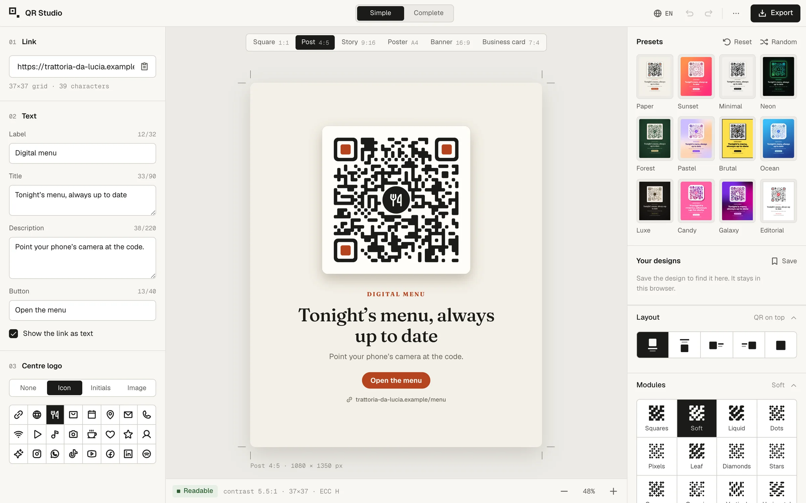
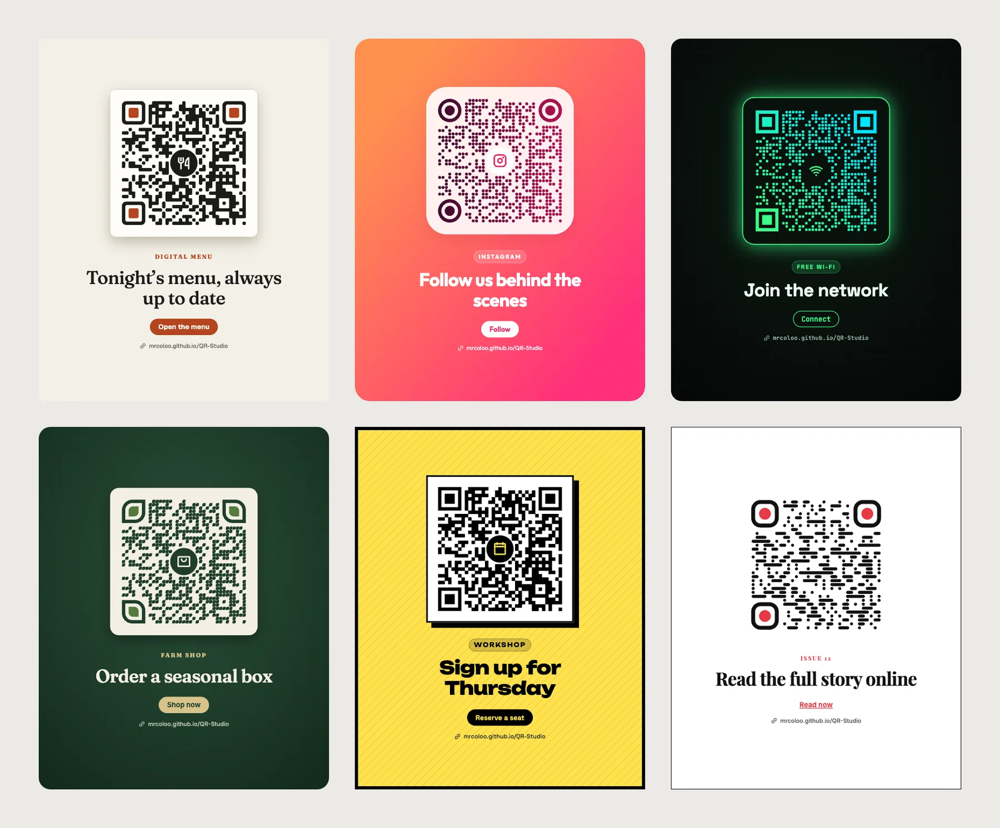
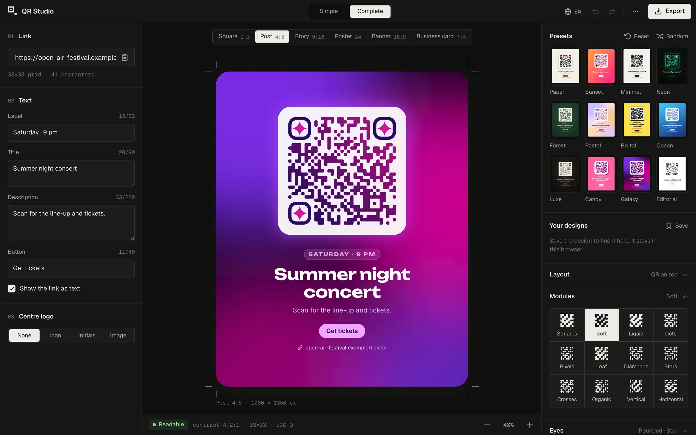
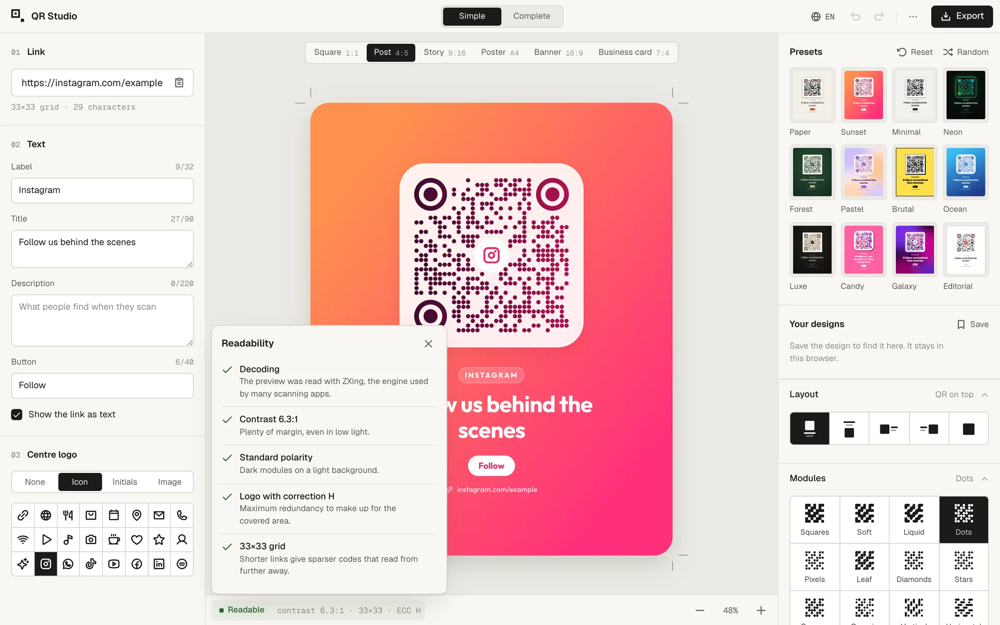
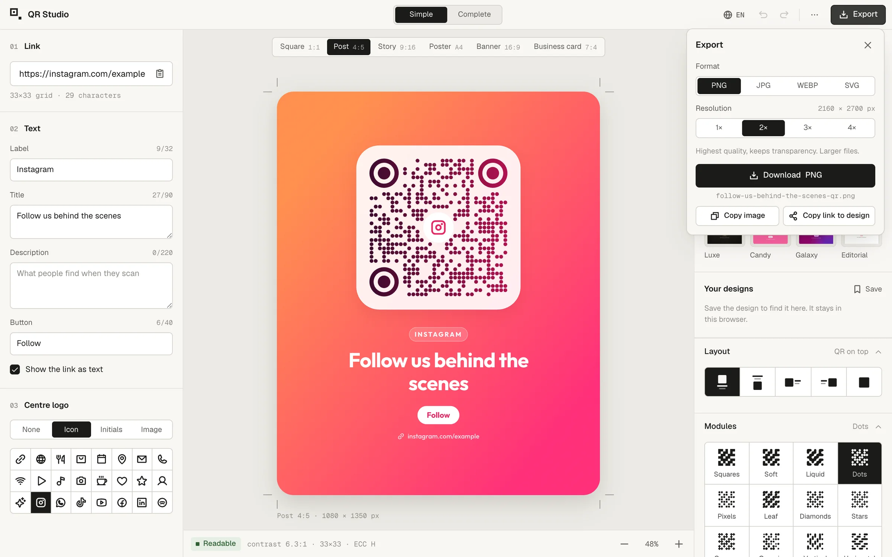
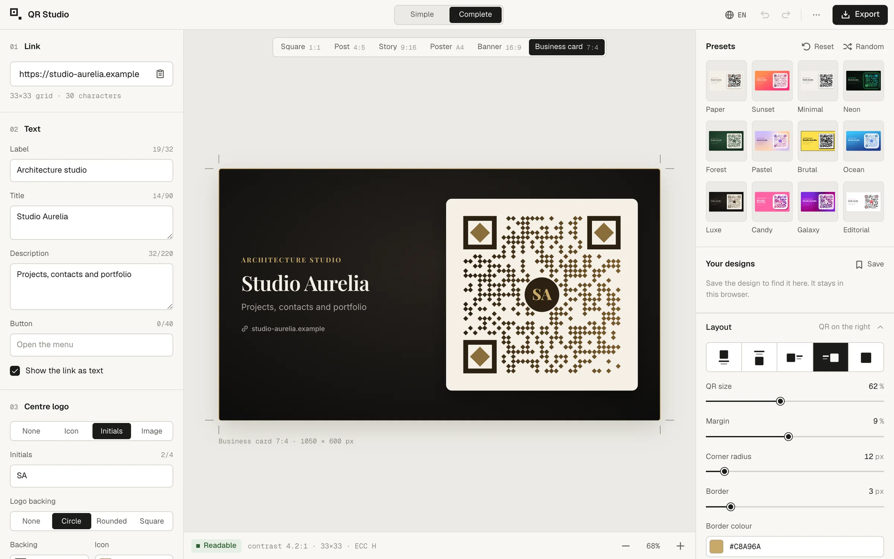
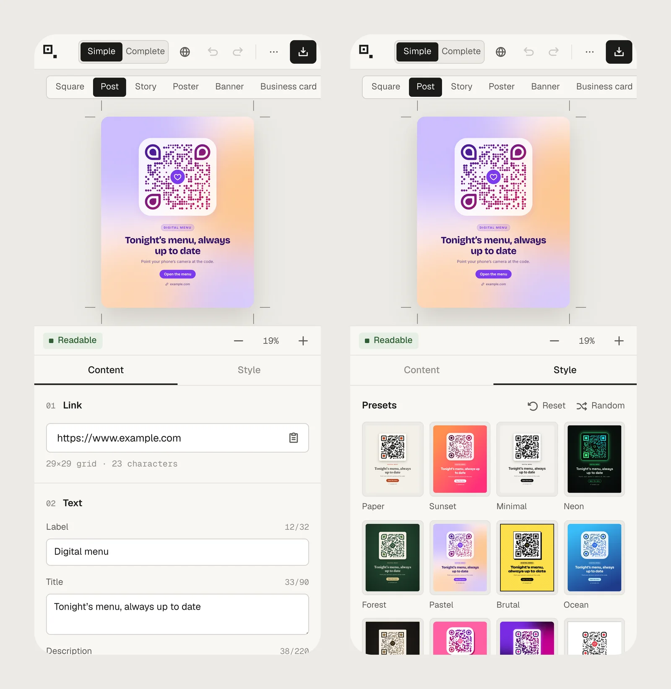
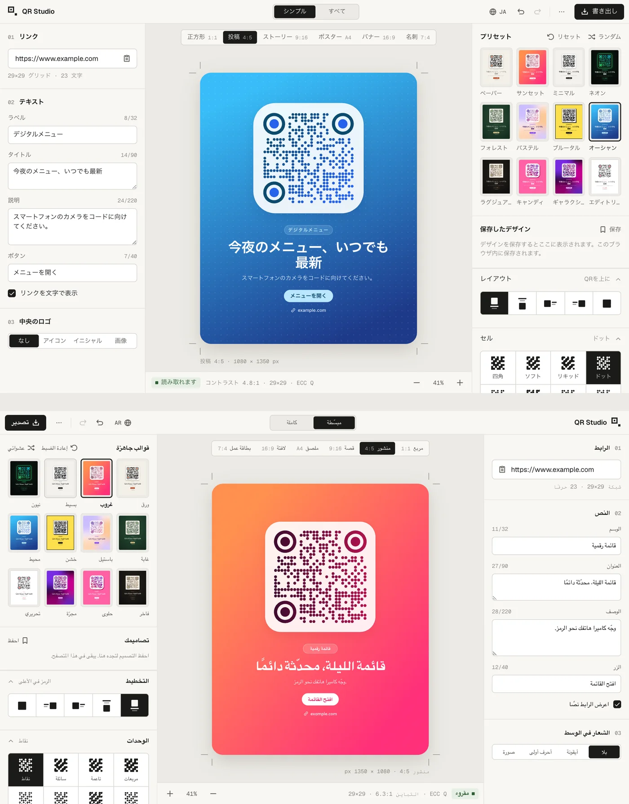
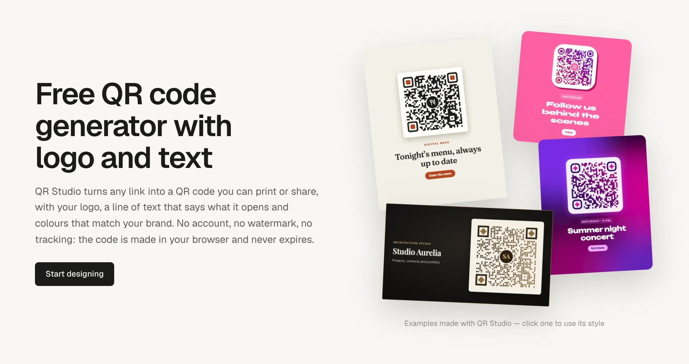

# QR Studio

**Design QR codes people actually want to scan.** Paste a link, add a line that says what it opens, drop in your logo and restyle every detail. Everything runs in your browser: no account, no watermark, no tracking, and the codes never expire.

**[Open QR Studio →](https://mrcoloo.github.io/QR-Studio/)**



## Made with QR Studio



Every design above comes straight out of the export pipeline and scans to this project's site.

## Features

**Content**
- Link with format check and live grid size, plus paste from clipboard
- Label, title, description and button text; optionally the link printed in clear
- Centre logo: 24 built-in icons, initials, or your own PNG, SVG, JPG or WEBP (drop it anywhere on the canvas)

**Style**
- 12 presets, a random style generator and a one-click reset to the default design
- 12 module shapes, 6 eye frames and 7 pupils, solid or gradient colours
- Solid, gradient, mesh or transparent backgrounds with optional texture
- A plate behind the code (solid or frosted glass) with shadows and borders
- 11 typefaces, sizes, weights and alignment
- 6 formats: square, 4:5 post, 9:16 story, A-series poster, 16:9 banner and business card, with 5 layouts

**Confidence**
- Every change is decoded with [ZXing](https://github.com/zxing-cpp/zxing-cpp), the engine behind many scanning apps, and the ink-to-background contrast is measured
- Error correction is raised automatically when a logo covers part of the code

**Output**
- PNG, JPG and WEBP up to 4×, or vector SVG with the fonts embedded for print
- Copy the image to the clipboard or copy a link that reopens the design
- Designs can be saved in the browser

## A closer look

### Simple or complete

The **Simple** version keeps only what most people need. **Complete** unlocks every control, from eye shapes and plate materials to typography and error correction. The choice is remembered.



### Know it scans before you print it

The status bar under the canvas reports whether the preview decodes, the contrast ratio, the grid size and the error-correction level. Open it for a plain-language breakdown and tips.



### Export



### Any shape of card

Wide formats switch to a side-by-side layout automatically.



### On your phone

The canvas stays on top; content and style sit in two tabs below.



### 12 languages

English, Spanish, Simplified Chinese, Hindi, Arabic (right to left), Portuguese, French, Russian, German, Japanese, Korean and Italian. The browser's language is picked up on the first visit, English is the fallback, and the choice can be changed from the globe button.



### A page that explains itself

Below the editor, each language has a short guide and FAQ, with floating example cards that follow the cursor. Clicking one applies its style. The cards are rendered once, only when the section comes into view, and animate with transforms only, so they cost next to nothing.



## Development

Requires Node.js 20.19 or later.

```bash
npm install
npm run dev
```

Production build into `dist/`, deployable to any static host:

```bash
npm run build
```

| Script | What it does |
| --- | --- |
| `npm run dev` | Development server |
| `npm run build` | Production build, one page per language plus `sitemap.xml` |
| `npm run preview` | Serves the production build |
| `npm run assets` | Regenerates the icons, manifest and social preview image in `public/` |
| `npm run glyphs` | Regenerates `src/glyphs.js` from Phosphor Icons |
| `npm run screenshots` | Regenerates the images in `docs/screenshots/` (needs `npm run dev` running and a Chromium-based browser; set `CHROME_PATH` if it isn't found) |

### Deployment

[`.github/workflows/deploy.yml`](.github/workflows/deploy.yml) builds and publishes to GitHub Pages on every push to `main`. In the repository settings, under *Settings → Pages*, the source must be **GitHub Actions**.

### Languages and SEO

Each language gets its own static page (`/`, `/it/`, `/es/`…), written at build time by [`vite.config.js`](vite.config.js) with a translated title, description, `hreflang` alternates, Open Graph tags, structured data (`WebApplication` and `FAQPage`) and the guide below the editor. After the first deploy, add the site to [Google Search Console](https://search.google.com/search-console) and submit `sitemap.xml`.

To add a language:
1. Copy `src/i18n/locales/en.js` to `src/i18n/locales/<code>.js` and translate it.
2. Add it to `LOCALES` in [`src/i18n/config.js`](src/i18n/config.js).
3. Add the code to the list in the script at the top of `index.html` and to the imports in `vite.config.js`.

### Project structure

| Path | Role |
| --- | --- |
| `src/qr.js` | QR matrix and SVG paths for modules and eyes |
| `src/render.js` | Composes the whole card into one SVG, used for the preview, export and scan check alike |
| `src/export.js` | Rasterising, font embedding and the ZXing scan check |
| `src/controls.js` | Panel schema (with the simple/complete split) and its binding to the state |
| `src/state.js` | State with undo/redo, local saving and shareable links |
| `src/data.js` | Formats, fonts, presets and the default design |
| `src/showcase.js` | The floating example cards below the editor |
| `src/i18n/` | Supported languages, dictionaries and static markup translation |
| `src/glyphs.js` | The Phosphor icons the app uses (generated) |

## Contributing

Issues and pull requests are welcome. For larger changes, please open an issue first so we can talk it through. Before submitting, make sure `npm run build` passes and the readability badge stays green on every preset. Translations from native speakers are especially appreciated: see `src/i18n/locales/`.

## Credits

- [qrcode-generator](https://github.com/kazuhikoarase/qrcode-generator) (MIT) for encoding
- [zxing-wasm](https://github.com/Sec-ant/zxing-wasm) (MIT, ZXing-C++ Apache-2.0) and [jsQR](https://github.com/cozmo/jsQR) (Apache-2.0) for the scan check
- [Phosphor Icons](https://phosphoricons.com) (MIT)
- Typefaces served through [Fontsource](https://fontsource.org) under the SIL Open Font License

## License

[MIT](LICENSE)
